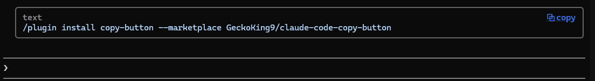

# copy-button

**Ctrl+click to copy any code block in Claude Code.** One click, exact text,
straight to your clipboard. Works in WSL with Windows Terminal, and on Linux
desktops.



> **Normal mode only** (Claude Code's default renderer, not fullscreen). You
> **Ctrl+click** the link. Runs in **WSL + Windows Terminal** and on **Linux
> desktops**; anywhere else it stays out of the way. See
> [Where it works](#where-it-works).

## Why

Copying a code block out of Claude Code in the terminal is annoying:

- Mouse selection grabs the indent, splits long lines where they wrapped, and
  drags along whatever is next to the block.
- `/copy` copies the last reply (or lets you pick from it), so for a block
  further up you have to count back with `/copy N`.

With this mod every code block gets a small box with a `⧉ copy` link in the
corner. Ctrl+click it and the block is on your clipboard, exactly as written,
no matter how far up it is.

## Install

In Claude Code (terminal):

```
/plugin install copy-button --marketplace GeckoKing9/claude-code-copy-button
```

Answer `y` to add the marketplace and pick the user scope. That's it, it is
active right away. Needs Claude Code 2.1.287 or later (the version that added
mods).

On Linux you also need a clipboard tool: `xclip` (X11) or `wl-clipboard`
(Wayland), from your package manager. Desktops already ship the other two
pieces it uses, `xdg-utils` and `shared-mime-info`.

If Claude Code opens fullscreen for you (newer installs can), switch to normal
mode with `/tui default`. In fullscreen the mod steps aside.

## Where it works

| Setup | Status |
|---|---|
| WSL 2 + Windows Terminal, normal mode | Yes. Tested. |
| Linux, X11 (tested: Xubuntu 24.04, xfce4-terminal, xclip) | Yes. Tested with a real Ctrl+click. |
| Linux, Wayland (wl-clipboard) | Should work, same handler. Not tested yet. |
| Other Linux terminals (GNOME Terminal, Konsole, kitty...) | Should work if the terminal opens `file:` links on Ctrl+click. Only xfce4-terminal is tested. |
| Bare window managers (i3, sway...) | Probably not: there `xdg-open` guesses the file type from its content, so the click opens the block in a text editor. |
| SSH sessions, including `ssh -X` | No, on purpose: the links would point at the remote machine. |
| Fullscreen renderer | No. The mod steps aside and the reply is drawn as usual. |
| VS Code terminal, other Windows terminals | No. They open `file:` links their own way. |
| macOS | Not yet. The mod draws nothing and runs nothing. |

macOS would need its own click handler (a file type that runs `pbcopy`). Happy to take a
PR from someone who can test it on a real Mac.

## How it works

Normal mode has no click events. The one click you get is the terminal's own
Ctrl+click on a link. So:

1. When a reply arrives, each code block is saved to its own `.ccopy` file.
2. The reply is drawn with a box around each block and a copy link to that
   file.
3. The mod registers a `.ccopy` file type for your user (no admin, no sudo)
   whose handler puts the file's text on the clipboard.

| | WSL | Linux |
|---|---|---|
| Files | `%LOCALAPPDATA%\claude-copy` | `~/.local/share/claude-copy` (`$XDG_DATA_HOME`) |
| File type | `HKCU\Software\Classes\.ccopy` | shared-mime type `application/x-claude-copy` + a hidden `.desktop` entry, set as its default app |
| Handler | `windows/copy.vbs` (Windows `clip`) | `linux/copy.sh` (`wl-copy`, `xclip` or `xsel`) |

Why a custom extension instead of linking a script: Windows Terminal warns
before opening anything in `PATHEXT` (`.vbs`, `.cmd`...). `.ccopy` isn't in
it, so the click is silent.

Session folders are deleted two days after the session was last used.

## What it touches

Read this before installing anything that runs scripts, including this.

**WSL**
- **Files:** `%LOCALAPPDATA%\claude-copy` (your code blocks, one folder per
  session, and a copy of `copy.vbs`).
- **Registry:** `HKCU\Software\Classes\.ccopy` and
  `HKCU\Software\Classes\ClaudeCopy` (current user only, no admin).
- **Commands:** `cmd.exe` once to find `%LOCALAPPDATA%`, `wslpath`, `reg.exe`
  to check the file type each session (and add it when missing), `rm` to prune
  old session folders.

**Linux**
- **Files:** `~/.local/share/claude-copy` (code blocks and `copy.sh`),
  `~/.local/share/mime/packages/claude-copy.xml`,
  `~/.local/share/applications/claude-copy.desktop`, and one line in
  `~/.config/mimeapps.list` (written by `xdg-mime`).
- **Commands:** `uname`, `xdg-mime`, `update-mime-database`,
  `update-desktop-database`, `chmod` on its own script, `rm` to prune old
  session folders.

**Both**
- Checked each session and repaired if something removed it. All of it runs
  in the background; drawing only ever waits (up to 2 seconds) for the mod to
  find its folder at the start of a session.
- **Network:** none.

The handler (`windows/copy.vbs`, `linux/copy.sh`) only copies `.ccopy` files
from its own folder, so a stray `.ccopy` file from a download or a web page
can't replace your clipboard. Errors go to the Claude Code debug log
(`claude --debug`).

Heads up for Windows: Microsoft is phasing VBScript out. If it gets removed on
your machine the click stops working until the script is replaced.

## Uninstall

1. `/plugin uninstall copy-button`
2. Remove the file type and the files.

   WSL:

   ```
   reg.exe delete 'HKCU\Software\Classes\.ccopy' /f
   reg.exe delete 'HKCU\Software\Classes\ClaudeCopy' /f
   rm -rf "$(wslpath "$(cmd.exe /c 'echo %LOCALAPPDATA%' 2>/dev/null | tr -d '\r')")/claude-copy"
   ```

   Linux:

   ```
   d=${XDG_DATA_HOME:-$HOME/.local/share}
   rm -rf "$d/claude-copy" "$d/applications/claude-copy.desktop" "$d/mime/packages/claude-copy.xml"
   update-mime-database "$d/mime"
   sed -i '/x-claude-copy/d' "${XDG_CONFIG_HOME:-$HOME/.config}/mimeapps.list"
   ```

## Known limits

- A reply that **starts** with a code block shows no bullet dot in front of it.
- Markdown that spans a code block (a reference link defined on the other side
  of one, a list item continued with 4+ spaces after one) can render
  differently than without the mod, since the reply is drawn in pieces.
- A reply drawn in the first moments of a session waits up to 2 seconds for
  the mod to find its folder; if that takes longer, that one reply has no box.

## Develop

```
git clone https://github.com/GeckoKing9/claude-code-copy-button
claude --plugin-dir ./claude-code-copy-button
claude plugin test ./claude-code-copy-button
```

MIT license.
